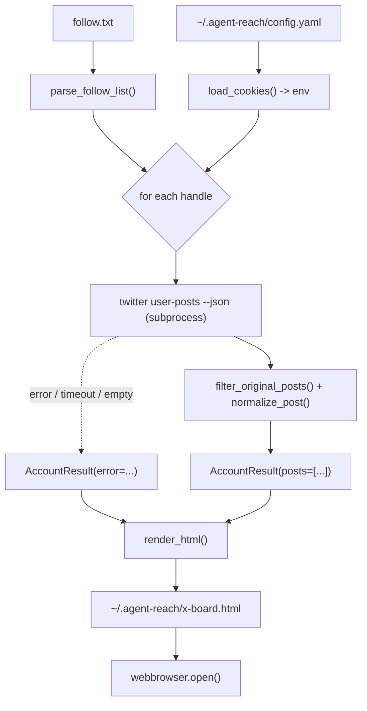

# feat: X Board — local HTML viewer for fetched X posts

## Summary

Build `scripts/x_board.py`: a standalone, read-only helper that reads a
user-edited follow-list, fetches each person's recent **original** posts through
the already-installed `twitter-cli`, and writes a self-contained, grouped-by-
account HTML page (auto-opened in the browser) with per-account "N posts fetched"
proof badges and a status bar. Pure Python, no LLM, no new runtime dependencies,
and **no changes to `agent_reach/` source** — it stays a glue-layer helper that
shells out to `twitter`, mirroring the cookie-loading pattern already proven in
`scripts/verify_twitter.ps1`.

---

## Problem Frame

Twitter/X access is installed and verified, but the only proof is CLI output. The
user wants a **visual** dashboard that (a) confirms fetching genuinely works and
(b) reads recent posts from a small, hand-picked set of people — in one glance.
Agent-Reach has no frontend today; the fetch path is 100% Python
(`twitter-cli` → `curl-cffi` → x.com API → JSON). This feature is a thin **view**
over that same Python-fetched data; it must not reimplement fetching or introduce
an LLM (see origin: `docs/brainstorms/2026-06-05-x-board-requirements.md`).

---

## Requirements

Traced to the origin requirements doc (R1–R13).

- **R1/R2 — Follow-list:** read handles from a user-edited text file (one `@handle` per line; `@` optional; blank lines and `#` comments ignored). Default `~/.agent-reach/follow.txt`, overridable; missing file → clear message + non-zero exit.
- **R3 — Count:** ~10 recent posts per person, configurable.
- **R4 — Fetch via twitter-cli:** cookies loaded from `~/.agent-reach/config.yaml`, passed via `TWITTER_AUTH_TOKEN` / `TWITTER_CT0` env vars; no direct HTTP/scraping.
- **R5 — Original-posts filter:** exclude replies and reposts; applied client-side from JSON (no CLI flag exists — confirmed).
- **R6 — Per-handle resilience:** a failing handle (suspended / rate-limited / network / unknown / empty) surfaces per-account without aborting the run.
- **R7 — Output:** one self-contained HTML file (inline CSS, no external assets), opened in the default browser; default `~/.agent-reach/x-board.html`, overridable.
- **R8 — Layout:** grouped by account; header shows handle + display name + "N posts fetched" badge; posts show text, relative time, like/repost counts, permalink.
- **R9 — Status bar:** overall result (✅ all OK / ⚠️ partial M of N), account count, fetch timestamp.
- **R10 — Graceful degradation:** error accounts render an error card with reason + remediation hint.
- **R11 — Delivery:** standalone `scripts/x_board.py`, runnable via the venv on any OS; no new runtime deps beyond what the venv has.
- **R12 — Read-only:** no write actions, no DB, no telemetry; only side effect is writing the HTML file.
- **R13 — No source/credential leakage:** lives only under `scripts/`; no tokens embedded in output HTML.

---

## Key Technical Decisions

- **KTD1. Standalone Python script with importable pure functions behind a thin CLI.** Keeps it a glue-layer helper (honors "never modify Agent-Reach/upstream source"), is cross-platform (unlike the PowerShell verify script), and makes the parse/filter/render logic unit-testable.
- **KTD2. Load cookies by importing `agent_reach.config.Config` directly.** The script runs under the venv where `agent_reach` is installed, so `Config().get("twitter_auth_token")` reads exactly what `configure` wrote and also resolves the uppercase env-var fallback for free — avoiding the brittle YAML/quoting issues that bit the PowerShell script. (See origin assumption; pattern in `agent_reach/config.py`.)
- **KTD3. Fetch through `twitter-cli` subprocess, one call per handle.** `twitter user-posts <handle> -n <N> --json` (flags confirmed). Display name is read from the author object embedded in that same response — no separate `twitter user` call, halving requests and rate-limit exposure.
- **KTD4. Client-side original-posts filter.** `user-posts` has no exclude flag, so drop replies (reply markers present) and reposts (`retweeted_status` present / `RT @` prefix) from the JSON. Fetch a buffer (> N) before filtering, then trim to N.
- **KTD5. Zero new dependencies — stdlib only for rendering.** `html.escape` + string templating for HTML, `webbrowser` to open, `argparse`, `pathlib`, `subprocess`, `json`. `rich` (already installed) optional for console progress only.
- **KTD6. Files live under `~/.agent-reach/`.** Follow-list and output HTML default outside the repo so the git clone stays clean, consistent with where cookies/config already live.
- **KTD7. Exit codes encode the proof.** `0` all accounts OK, `1` partial (some errors — page still written/opened), `2` setup error (no cookies / no follow file). Makes the board both human-glanceable and scriptable.

---

## High-Level Technical Design

Linear fetch-render pipeline; per-handle errors branch into the same render step
as error cards rather than aborting.

---

## Implementation Units

### U1. Input layer — cookie loading + follow-list parsing

- **Goal:** Load Twitter cookies from config and parse the follow-list file into a clean, ordered, de-duplicated list of handles.
- **Requirements:** R1, R2, R4 (cookie-load portion)
- **Dependencies:** none
- **Files:** `scripts/x_board.py` (new), `tests/test_x_board.py` (new)
- **Approach:**
  - `load_cookies()` → uses `agent_reach.config.Config` to return `(auth_token, ct0)`; raises a clear `XBoardError` with a `configure twitter-cookies` hint when either is absent (Config already falls back to `TWITTER_AUTH_TOKEN` / `TWITTER_CT0`).
  - `parse_follow_list(path)` → reads the file; trims whitespace; skips blank lines and `#` comments; strips a leading `@`; de-dupes preserving first-seen order. Missing file raises `XBoardError` naming the path and pointing to `scripts/follow.sample.txt`.
- **Patterns to follow:** `agent_reach/config.py` (`Config.get`, keys `twitter_auth_token` / `twitter_ct0`); cookie-loading concept from `scripts/verify_twitter.ps1`.
- **Test scenarios:**
  - `parse_follow_list`: strips `@`; ignores blanks and `#` comments; de-dupes (order preserved); trims surrounding whitespace; preserves case. Empty file → `[]`.
  - `parse_follow_list` missing file → raises `XBoardError` whose message names the path and the sample file.
  - `load_cookies`: returns the pair when set in config; resolves from env-var fallback; raises `XBoardError` with remediation when neither is present.
- **Verification:** Given a sample follow-file, `parse_follow_list` returns the expected ordered handles; `load_cookies` returns the configured token pair or a clear error.

### U2. Fetch layer — per-handle twitter-cli call, normalize, filter, error capture

- **Goal:** For each handle, fetch posts via `twitter-cli`, parse JSON, filter to original posts, normalize to a small post model, and capture per-handle failures without aborting.
- **Requirements:** R3, R4, R5, R6
- **Dependencies:** U1
- **Files:** `scripts/x_board.py`, `tests/test_x_board.py`
- **Execution note:** `filter_original_posts` and `normalize_post` are pure and well-specified — write their tests first.
- **Approach:**
  - `fetch_handle(handle, count, env, timeout)` → runs `twitter user-posts <handle> -n <buffer> --json` via `subprocess.run` with `env` carrying the cookie vars; trims any leading non-JSON noise before `json.loads`. Non-zero exit / timeout / parse failure / empty result → returns `AccountResult` with `error` set (human reason), never raises out.
  - `filter_original_posts(items)` → drops replies (reply markers such as `in_reply_to_status_id_str` / `in_reply_to_screen_name`) and reposts (`retweeted_status` present or `RT @` prefix). Exact field names confirmed at implementation time from one sample `--json` response (directional list above).
  - `normalize_post(item, handle)` → extracts text (`full_text` else `text`), `created_at`, like count (`favorite_count`), repost count (`retweet_count`), permalink `https://x.com/<handle>/status/<id_str>`; tolerant of missing fields (counts default 0).
  - `extract_display_name(items, handle)` → reads the embedded author/user object if present, else falls back to `@handle`.
  - Returns `AccountResult(handle, display_name, posts, error, fetched_count)`; buffer-fetch (> count) then trim to `count` after filtering.
- **Patterns to follow:** `agent_reach/channels/twitter.py` (subprocess invocation of `twitter`, reading stdout, env handling); `scripts/verify_twitter.ps1` (env passing + leading-noise-trim before JSON parse).
- **Test scenarios:**
  - `filter_original_posts`: drops replies; drops reposts (`retweeted_status` and `RT @`); keeps originals; empty input → empty.
  - `normalize_post`: maps fields; builds correct permalink; prefers `full_text` over `text`; missing like/repost counts default to 0.
  - `fetch_handle` (mocked subprocess): success → normalized original posts trimmed to count; non-zero exit → `error` set; timeout → `error`; invalid JSON → `error`; empty list → flagged; asserts cookie env vars were passed. (Covers R6.)
- **Verification:** With a mocked `twitter-cli`, `fetch_handle` returns normalized original posts trimmed to count; every failure mode surfaces as `AccountResult.error` and never propagates as an exception.

### U3. Render layer — self-contained HTML

- **Goal:** Render `AccountResult`s into one self-contained HTML page: status bar, per-account sections with proof badges and post cards, error cards. Everything HTML-escaped; no external assets; no credentials in output.
- **Requirements:** R7 (HTML structure), R8, R9, R10, R13
- **Dependencies:** U2 (consumes the `AccountResult` model)
- **Files:** `scripts/x_board.py`, `tests/test_x_board.py`
- **Approach:**
  - `render_html(results, generated_at)` → returns a complete HTML document string with an inline `<style>`. Top status bar: overall ✅/⚠️ (partial when any account errored), `M ok / N total`, timestamp. One `<section>` per account: header (display name, `@handle`, "N posts fetched" badge or error label); each post: escaped text (line breaks preserved), relative time with absolute date as `title`, like/repost counts, permalink (`target=_blank rel=noopener`). Error accounts: error card with reason + hint ("cookies may be stale — re-run `agent-reach configure twitter-cookies`").
  - `format_relative_time(created_at, now)` → `"2h"`, `"5h"`, `"3d"`; falls back to an absolute date for old/unparseable values. Pure.
  - All dynamic values pass through `html.escape`; cookie/token values are never interpolated into output (R13).
  - Self-contained: inline CSS only; no CDN, web fonts, or remote images (text-only, no avatars by default — see Open Questions).
- **Patterns to follow:** stdlib `html.escape`; minimal, legible inline styling.
- **Test scenarios:**
  - `render_html`: output is one string containing the status bar, one section per account, the "N posts fetched" badge with the correct count, and post text. (Covers R8, R9.)
  - `render_html` escaping: a post containing `<script>` / `&` / quotes is escaped; a malicious handle/display name is escaped. (Covers R13.)
  - `render_html` partial failure: an errored account renders an error card with reason + remediation hint, and the status bar shows ⚠️ `M of N`. (Covers R10.)
  - `render_html` credential safety: given a context that includes token values, no `auth_token`/`ct0` value appears anywhere in the output. (Covers R13.)
  - `format_relative_time`: minute/hour/day boundaries; very old → absolute date; missing/unparseable `created_at` → graceful fallback.
- **Verification:** Given fixture `AccountResult`s (mix of success + error), `render_html` returns valid self-contained HTML with badges, escaped content, and a partial-status bar; opening the file shows the board.

### U4. CLI orchestration + packaging

- **Goal:** Wire the layers behind a CLI: parse args, run the pipeline, write the HTML, open it in the browser, set exit codes; ship a sample follow-list.
- **Requirements:** R7 (write + open + default paths), R11, R12, plus the end-to-end success criteria
- **Dependencies:** U1, U2, U3
- **Files:** `scripts/x_board.py`, `scripts/follow.sample.txt` (new), `tests/test_x_board.py`
- **Approach:**
  - `main(argv)` with `argparse`: `--file` (default `~/.agent-reach/follow.txt`), `-n/--count` (default 10), `--out` (default `~/.agent-reach/x-board.html`), `--no-open` (default: open).
  - Flow: `load_cookies()` (missing → exit 2 with configure hint) → `parse_follow_list()` (missing file → exit 2, point to `scripts/follow.sample.txt`) → build env → fetch each handle sequentially (print simple per-handle progress) → `render_html()` → write to `--out` (UTF-8) → `webbrowser.open()` unless `--no-open`.
  - Exit codes per KTD7: 0 all-OK, 1 partial, 2 setup error.
  - Cross-platform via `pathlib` + `webbrowser`; no new deps. The script's module docstring documents usage.
  - `scripts/follow.sample.txt`: a few example handles + a comment explaining the format.
  - **Test import path:** `scripts/` is not an importable package (the suite imports `agent_reach`). Make `scripts/x_board.py` importable from `tests/test_x_board.py` via a `conftest.py` that adds `scripts/` to `sys.path` (or `importlib.util.spec_from_file_location`) — decided at implementation time; both are stdlib-only and avoid touching `pyproject.toml` / `agent_reach`.
- **Patterns to follow:** `argparse` structure in `agent_reach/cli.py`; stdlib `webbrowser`.
- **Test scenarios:**
  - `main` happy path (monkeypatched fetch, tmp paths): writes the out file, returns 0, calls `webbrowser.open` unless `--no-open`.
  - `main` partial: some handles error → returns 1, file still written and complete.
  - `main` missing follow file → returns 2 with a message pointing to the sample; missing cookies → returns 2 with the configure hint.
  - Flags: `--no-open` suppresses the browser; `--out` / `--file` / `-n` are respected.
  - Integration: end-to-end with a mocked subprocess returning fixture JSON → produced HTML contains the expected accounts and posts (no mocks for the render/filter chain). (Covers success criteria.)
- **Verification:** Running the script against a sample follow-list writes `~/.agent-reach/x-board.html`, opens it, and the exit code reflects all-OK vs partial vs setup-error.

---

## Risks & Dependencies

- **twitter-cli JSON field names unverified at plan time.** `user-posts -n --json` is confirmed, but exact field keys (`full_text`/`text`, reply/repost markers, `id_str`, count fields) are confirmed at implementation time from one sample response. Mitigation: `normalize_post` / `filter_original_posts` written defensively with fallbacks; U2 tests use fixtures matching the confirmed shape.
- **Rate limiting across many handles.** Sequential one-call-per-handle keeps volume low; large lists could still hit limits. Mitigation: keep lists small; rate-limit errors surface per-account as error cards (R6/R10), not a crash.
- **Cookie staleness.** Expired cookies → all accounts error. Mitigation: error cards carry the re-`configure` hint; exit code 1.
- **Repost/reply detection is heuristic.** Field-based detection plus `RT @` fallback is best-effort; an occasional misclassification is acceptable for a personal reader.
- **`created_at` format parsing.** Twitter's timestamp format must be parsed in `format_relative_time`; unparseable values fall back to a raw/absolute display.
- **Dependency:** Twitter/X already configured and working (`twitter status` → `ok: true`); `twitter` on PATH via the venv.

---

## Scope Boundaries

### Deferred to follow-up (addable later, no rework)

Carried from origin: live local web app with a Refresh button; merged
chronological feed; image/video/media thumbnails; auto-refresh or scheduled runs;
in-page search/filter; including reposts & replies; pulling the account's real
following list; per-person long-form "Articles" beyond what appears in the
timeline.

### Out of scope

Carried from origin: any write actions (post / like / follow / bookmark);
persisting a post-history database or cross-run cache; multi-user, hosting, or
remote access; re-implementing X fetching or adding any LLM/AI step to fetch or
render.

---

## Open Questions (non-blocking — default chosen)

- **Relative-time detail & avatars.** Default: text-only, no remote images, to keep the page self-contained (R7); `format_relative_time` granularity (`2h`/`3d` then absolute date) resolved during implementation. Revisit only if the board feels too sparse.

---

## Sources / Research

- Origin: `docs/brainstorms/2026-06-05-x-board-requirements.md` (problem frame, R1–R13, scope, decisions).
- `scripts/verify_twitter.ps1` — cookie load → env → `twitter-cli` invocation + JSON-noise-trim pattern (in-session precedent).
- `agent_reach/config.py` — `Config.get`, keys `twitter_auth_token` / `twitter_ct0`, uppercase env fallback.
- `agent_reach/channels/twitter.py` — how Agent-Reach shells out to `twitter` (subprocess, env, stdout parsing).
- `agent_reach/cli.py` — `argparse` conventions.
- twitter-cli 0.8.5 help (in-session): `twitter user-posts SCREEN_NAME -n N --json` confirmed; no reply/repost exclude flag (→ client-side filter); `user-posts` returns author info inline (→ no separate `user` call).
